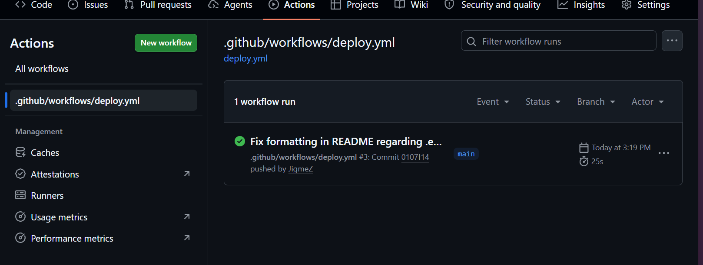
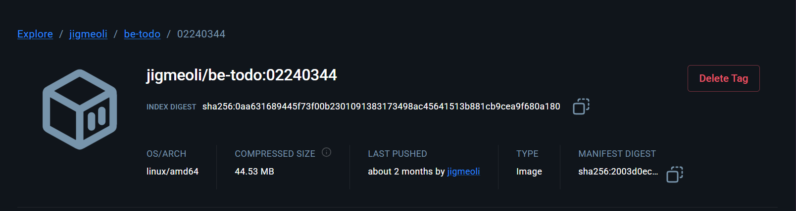
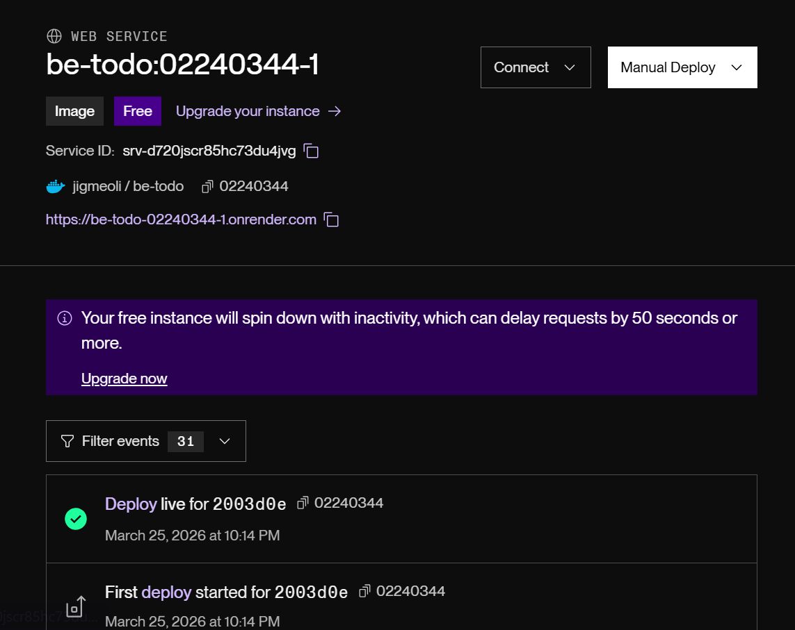

# DSO101 - To-Do List Web Application

---

# Assignment I: Web Application Development & Docker Deployment

## Part 1: Web Application Setup 

### What I Did

I created a full-stack to-do application with:

**Frontend (React):**

- Built with `create-react-app`
- UI components for task management (add, edit, delete, complete tasks)
- Uses `REACT_APP_API_URL` environment variable to connect to backend API

**Backend (Node.js + Express):**

- CRUD API endpoints: `GET /api/tasks`, `POST /api/tasks`, `PUT /api/tasks/:id`, `DELETE /api/tasks/:id`
- Health check endpoint: `GET /api/health`
- Database integration with PostgreSQL via `pg` driver
- CORS enabled for frontend-backend communication

**Database (PostgreSQL):**

- Tasks table with columns: `id`, `title`, `description`, `completed`, `created_at`
- Persistent storage for all tasks


## Part 2: Docker Containerization

### What I Did

**Backend Dockerfile:**

```dockerfile
FROM node:18-alpine
WORKDIR /app
COPY package*.json ./
RUN npm install
COPY . .
EXPOSE 5000
CMD ["node", "server.js"]
```

**Frontend Dockerfile:**

```dockerfile
FROM node:18-alpine as builder
WORKDIR /app
COPY package*.json ./
RUN npm install
COPY . .
RUN npm run build

FROM nginx:alpine
COPY --from=builder /app/build /usr/share/nginx/html
EXPOSE 3000
CMD ["nginx", "-g", "daemon off;"]
```

Images successfully pushed to Docker Hub:

- Backend: https://hub.docker.com/r/jigmeoli/be-todo
- Frontend: https://hub.docker.com/r/jigmeoli/fe-todo

---

## Part 3: Deployment on Render.com

**Frontend Service:**

1. Created Web Service → Selected "Existing image from Docker Hub"
2. Image URL: `jigmeoli/fe-todo:02240344`
3. Set environment variable:
   - `REACT_APP_API_URL=https://be-todo-02240344-1.onrender.com`
4. Service deployed at: https://fe-todo-02240344.onrender.com

**Database:**

- Created PostgreSQL database on Render with automatic backups
- Credentials securely configured

---

## Challenges Faced

### Challenge 1: Database Connection on Render

**Problem:** Connection kept timing out when deploying to Render with custom credentials.

**Solution:** Switched to Render's managed PostgreSQL service which provides pre-configured credentials and better network connectivity.

### Challenge 2: Frontend Build Size

**Problem:** Docker image for frontend was too large (~500MB+).

### **Solution:** Implemented multi-stage build in Dockerfile - build in Node container, then copy only built artifacts to lightweight Nginx container. Reduced size to ~50MB.


# Assignment II: Automated Deployment with Blueprints

## What I Did

I created a `render.yaml` Blueprint file that enables automatic builds and deployments whenever code is pushed to GitHub.

## Setup Steps

### 1. Connect GitHub Repository to Render

### 2. Created Blueprint from YAML

- Backend service with Docker deployment
- Frontend service with Docker deployment
- PostgreSQL database
- Environment variable dependencies

### 3. Enabled Automatic Deployment

## Automated Deployment Flow

```
GitHub Push
    ↓
GitHub Webhook → Render
    ↓
Render reads render.yaml
    ↓
Build Backend Service
    ↓
Build Frontend Service
    ↓
Deploy PostgreSQL Database
    ↓
Set Environment Variables
    ↓
Health Check
    ↓
Services Live
```

## Screen shots


## Challenges Faced

### Challenge 1: Environment Variable References

**Problem:** Frontend needed to know Backend URL, but it wasn't available until deployment.

**Solution:** Used `fromService` property in Blueprint to dynamically reference Backend service URL:

```yaml
REACT_APP_API_URL:
  fromService:
    name: be-todo
    property: url
```

## Test Successful


## Links

# Assignment III

---

## What I Did

I set up a CI/CD pipeline so that every time I push code to GitHub, it automatically builds a Docker image, pushes it to DockerHub, and deploys it on Render.com.

---

## Steps I Took

**1. Created a Dockerfile in the Backend folder**  
This packages my Node.js app into a Docker container.

**2. Created `.github/workflows/deploy.yml`**  
This tells GitHub Actions to automatically build and deploy my app on every push.

**3. Added GitHub Secrets**  
I added `DOCKERHUB_USERNAME`, `DOCKERHUB_TOKEN`, and `RENDER_DEPLOY_HOOK` as secrets so my credentials are never hardcoded.

**4. Pushed to DockerHub**  
GitHub Actions built my Docker image and pushed it to DockerHub automatically.

**5. Deployed on Render.com**  
Render pulls the image from DockerHub and runs it live.

---

## Challenges I Faced

## **2. Database Connection**

## What I Learned

- How GitHub Actions workflows work
- How to store secrets safely in GitHub
- How to deploy a Docker app on Render.com

---

## Screenshots

### GitHub Actions - Successful Workflow



### DockerHub - Pushed Image



### Render.com - Live Deployment



---

## Links

- **GitHub Repo:** https://github.com/JigmeZ/SS2025_DSO101_02240344
- **DockerHub Image:** https://hub.docker.com/r/jigmeoli/todo-app
- **Live App:** https://be-todo-02240344-1.onrender.com
